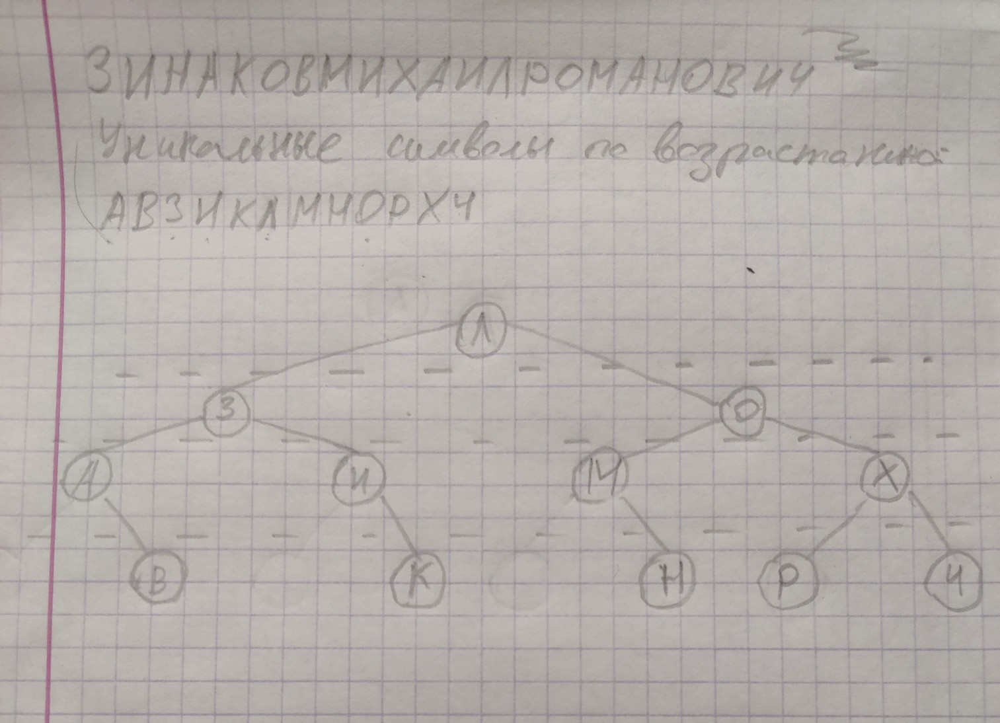

[Требования к заданию](https://nexus.michaelrayven.ru/task/22)  
[Варианты деревьев](https://drive.google.com/file/d/18vpu8F8RYfdkR85-3ukzAcA-ZyUX6IfY/view?usp=sharing)  
[Пособие стр. 44](https://drive.google.com/file/d/15siqjB_PpTFHuq4GM_NuahQenBEzU-6e/view?usp=sharing)

### Теоретическая основа

**Двоичное дерево поиска** — это двоичное дерево, в котором ключ в каждой вершине больше ключа любой вершины в левом поддереве и меньше ключа любой вершины в правом поддереве.

**Идеально сбалансированное дерево поиска (ИСДП)** — это двоичное дерево поиска, в котором для каждой вершины размеры левого и правого поддеревьев отличаются не более чем на 1.

**Свойства ИСДП:**
1. Высота ИСДП с n вершинами минимальна и равна h_ИСДП(n) = ⌊log₂(n+1)⌋
2. Если дерево идеально сбалансировано, то все его поддеревья также идеально сбалансированы
3. Максимальное количество сравнений при поиске: C_max = 2⌊log₂(n+1)⌋

**Алгоритм построения ИСДП:**
1. Сортировка массива элементов
2. Выбор среднего элемента отсортированного массива как корня
3. Рекурсивное построение левого поддерева из меньших элементов
4. Рекурсивное построение правого поддерева из больших элементов

### Ход выполнения

Начальные определения и вспомогательные функции:

```c
#include <stdbool.h>
#include <stdio.h>
#include <stdlib.h>
#include <time.h>

typedef struct Vertex {
    int data;
    struct Vertex *left;
    struct Vertex *right;
} Vertex;

void tree_traversal_downward(Vertex *root) {
    if (root != NULL) {
        printf("%d ", root->data);
        tree_traversal_downward(root->left);
        tree_traversal_downward(root->right);
    }
}

void tree_traversal_rightward(Vertex *root) {
    if (root != NULL) {
        tree_traversal_rightward(root->left);
        printf("%d ", root->data);
        tree_traversal_rightward(root->right);
    }
}

void tree_traversal_upward(Vertex *root) {
    if (root != NULL) {
        tree_traversal_upward(root->left);
        tree_traversal_upward(root->right);
        printf("%d ", root->data);
    }
}
```

#### 1. Ручное построение ИСДП

Для примера возьмем мое ФИО: "ЗИНАКОВМИХАИЛРОМАНОВИЧ"  
После удаления повторов и сортировки: "АВЗИКЛМНОРХЧ" (12 уникальных символов)



#### 2. Программное построение ИСДП

```c
int compare_ints(const void *a, const void *b) {
    return (*(int*)a - *(int*)b);
}

Vertex* build_ISDP(int A[], int L, int R) {
    if (L > R) {
        return NULL;
    } else {
        int m = (L + R) / 2;
        Vertex* p = (Vertex *)malloc(sizeof(Vertex));
        p->data = A[m];
        p->left = build_ISDP(A, L, m - 1);
        p->right = build_ISDP(A, m + 1, R);
        return p;
    }
}

Vertex* build_balanced_bst(int arr[], int n) {
    qsort(arr, n, sizeof(int), compare_ints);
    return build_ISDP(arr, 0, n - 1);
}

void generate_random_ints(int arr[], int n) {
    srand(time(NULL));
    for (int i = 0; i < n; i++) {
        arr[i] = (rand() % 20) + 1;
    }
}
```

#### 3. Вычисление характеристик дерева

```c
int tree_height(Vertex *root) {
    if (root == NULL) {
        return 0;
    }
    int lh = tree_height(root->left);
    int rh = tree_height(root->right);
    return 1 + (lh > rh ? lh : rh);
}

int tree_checksum(Vertex *root) {
    if (root == NULL) {
        return 0;
    }
    return root->data + tree_checksum(root->left) + tree_checksum(root->right);
}

int tree_size(Vertex *root) {
    if (root == NULL) {
        return 0;
    }
    return 1 + tree_size(root->left) + tree_size(root->right);
}

int tree_sum_path_lengths(Vertex *root, int depth) {
    if (root == NULL) {
        return 0;
    }
    return depth + tree_sum_path_lengths(root->left, depth + 1) +
           tree_sum_path_lengths(root->right, depth + 1);
}

float tree_average_height(Vertex *root) {
    if (root == NULL) {
        return 0;
    }
    return (float)tree_sum_path_lengths(root, 1) / tree_size(root);
}
```

#### Основная программа (main)

```c
int main() {
    int large_array[100];
    generate_random_ints(large_array, 100);
    
    printf("Сгенерированные числа: ");
    for (int i = 0; i < 100; i++) {
        printf("%d ", large_array[i]);
    }
    printf("\n");
    
    Vertex* large_tree = build_balanced_bst(large_array, 100);
    
    printf("Обход слева направо: ");
    tree_traversal_rightward(large_tree);
    printf("\n");
    
    printf("Размер дерева: %d\n", tree_size(large_tree));
    printf("Контрольная сумма: %d\n", tree_checksum(large_tree));
    printf("Высота дерева: %d\n", tree_height(large_tree));
    printf("Средняя высота: %.2f\n", tree_average_height(large_tree));
    
    return 0;
}
```

### Полный текст программы

Не содержит комментариев. 

```c
#include <stdbool.h>
#include <stdio.h>
#include <stdlib.h>
#include <time.h>

typedef struct Vertex {
    int data;
    struct Vertex *left;
    struct Vertex *right;
} Vertex;

int tree_height(Vertex *root) {
    if (root == NULL) {
        return 0;
    }
    int lh = tree_height(root->left);
    int rh = tree_height(root->right);
    return 1 + (lh > rh ? lh : rh);
}

int tree_checksum(Vertex *root) {
    if (root == NULL) {
        return 0;
    }
    return root->data + tree_checksum(root->left) + tree_checksum(root->right);
}

int tree_size(Vertex *root) {
    if (root == NULL) {
        return 0;
    }
    return 1 + tree_size(root->left) + tree_size(root->right);
}

int tree_sum_path_lengths(Vertex *root, int depth) {
    if (root == NULL) {
        return 0;
    }
    return depth + tree_sum_path_lengths(root->left, depth + 1) +
           tree_sum_path_lengths(root->right, depth + 1);
}

float tree_average_height(Vertex *root) {
    if (root == NULL) {
        return 0;
    }
    return (float)tree_sum_path_lengths(root, 1) / tree_size(root);
}

void init_tree(Vertex *root) {
    root->data = 6;

    root->left = (Vertex *)malloc(sizeof(Vertex));
    root->left->data = 3;
    root->left->left = (Vertex *)malloc(sizeof(Vertex));
    root->left->left->data = 1;
    root->left->left->right = (Vertex *)malloc(sizeof(Vertex));
    root->left->left->right->data = 2;
    
    root->left->right = (Vertex *)malloc(sizeof(Vertex));
    root->left->right->data = 4;
    root->left->right->right = (Vertex *)malloc(sizeof(Vertex));
    root->left->right->right->data = 5;

    root->right = (Vertex *)malloc(sizeof(Vertex));
    root->right->data = 9;
    root->right->left = (Vertex *)malloc(sizeof(Vertex));
    root->right->left->data = 7;
    root->right->left->right = (Vertex *)malloc(sizeof(Vertex));
    root->right->left->right->data = 8;
    
    root->right->right = (Vertex *)malloc(sizeof(Vertex));
    root->right->right->data = 11;
    root->right->right->left = (Vertex *)malloc(sizeof(Vertex));
    root->right->right->left->data = 10;
    root->right->right->right = (Vertex *)malloc(sizeof(Vertex));
    root->right->right->right->data = 12;
}

int compare_ints(const void *a, const void *b) {
    return (*(int*)a - *(int*)b);
}

Vertex* build_ISDP(int A[], int L, int R) {
    if (L > R) {
        return NULL;
    } else {
        int m = (L + R) / 2;
        Vertex* p = (Vertex *)malloc(sizeof(Vertex));
        p->data = A[m];
        p->left = build_ISDP(A, L, m - 1);
        p->right = build_ISDP(A, m + 1, R);
        return p;
    }
}

Vertex* build_balanced_bst(int arr[], int n) {
    qsort(arr, n, sizeof(int), compare_ints);
    return build_ISDP(arr, 0, n - 1);
}

void generate_random_ints(int arr[], int n) {
    srand(time(NULL));
    for (int i = 0; i < n; i++) {
        arr[i] = (rand() % 20) + 1;
    }
}

void tree_traversal_downward(Vertex *root) {
    if (root != NULL) {
        printf("%d ", root->data);
        tree_traversal_downward(root->left);
        tree_traversal_downward(root->right);
    }
}

void tree_traversal_rightward(Vertex *root) {
    if (root != NULL) {
        tree_traversal_rightward(root->left);
        printf("%d ", root->data);
        tree_traversal_rightward(root->right);
    }
}

void tree_traversal_upward(Vertex *root) {
    if (root != NULL) {
        tree_traversal_upward(root->left);
        tree_traversal_upward(root->right);
        printf("%d ", root->data);
    }
}

void print_tree_structure(Vertex* root, int space) {
    const int COUNT = 10;
    if (root == NULL) {
        return;
    }
    
    space += COUNT;
    
    print_tree_structure(root->right, space);
    
    printf("\n");
    for (int i = COUNT; i < space; i++) {
        printf(" ");
    }
    printf("%c\n", root->data);
    
    print_tree_structure(root->left, space);
}

int main() {    
    int large_array[100];
    generate_random_ints(large_array, 100);
    
    printf("Сгенерированные числа: ");
    for (int i = 0; i < 100; i++) {
        printf("%d ", large_array[i]);
    }
    printf("\n");
    
    Vertex* large_tree = build_balanced_bst(large_array, 100);
    
    printf("Обход слева направо: ");
    tree_traversal_rightward(large_tree);
    printf("\n");
    
    printf("Размер дерева: %d\n", tree_size(large_tree));
    printf("Контрольная сумма: %d\n", tree_checksum(large_tree));
    printf("Высота дерева: %d\n", tree_height(large_tree));
    printf("Средняя высота: %.2f\n", tree_average_height(large_tree));
    
    return 0;
}
```

